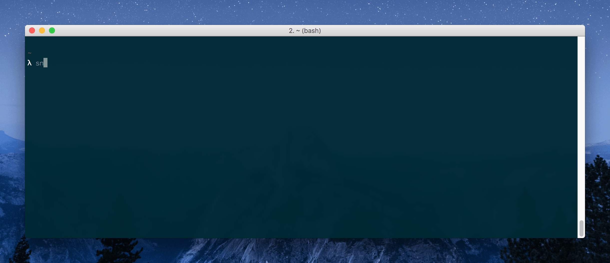

#  Snpt

[](https://github.com/mike182uk/snpt)
[](http://travis-ci.org/mike182uk/snpt)
[](https://coveralls.io/r/mike182uk/snpt)
[](https://goreportcard.com/report/github.com/mike182uk/snpt)
[](https://github.com/mike182uk/snpt)
[](https://github.com/mike182uk/snpt)

A [gist](https://gist.github.com/) powered CLI snippet retriever.

Save a snippet as a gist in GitHub, retrieve the snippet on the command line.



## Index

- [Prerequisites](#prerequisites)
- [Installation](#installation)
- [Usage](#usage)
  - [Syncing your snippets](#sync)
  - [Copying a snippet to the clipboard](#cp)
  - [Creating a file from a snippet](#write)
  - [Printing a snippet to the screen](#print)
  - [Listing available snippets](#list)
  - [Setting a new GitHub access token](#token)
  - [Viewing help for a command](#help)
  - [Improve your workflow with fuzzy search](#fuzzy-search)
  - [Alfred workflow](#alfred-workflow)
- [Bash completion](#bash-completion)
- [Uninstalling Snpt](#uninstall)

## <a id="prerequisites"></a>Prerequisites

- GitHub account (duh!)
- GitHub [access token](https://github.com/blog/1509-personal-api-tokens) with the `gist` scope enabled

## <a id="installation"></a>Installation

Download the binary compatible with your system from  [here](https://github.com/mike182uk/snpt/releases).

If you are using macOS, you can also use `Homebrew` to install snpt:

```bash
brew tap mike182uk/tap
brew install mike182uk/tap/snpt
```

## <a id="usage"></a>Usage

### <a id="syncing"></a>Syncing your snippets

Before you can use Snpt you will need to sync your gists:

```bash
snpt sync
```

If this is the first time you have synced your gists you will be prompted to input a GitHub [access token](https://github.com/blog/1509-personal-api-tokens) (you will need create this in your GitHub account). This token should be be created with the `gist` scope enabled.

The sync command will download all of your public and private gists and store them locally for fast retrieval by Snpt.

You can prevent specific gists from being synced by placing `[snpt:ignore]` anywhere in the description of the gist.

### <a id="list"></a>Listing available snippets

```
snpt ls
```

This can be useful for searching for a specific snippet: 

```bash
snpt ls | grep <query>
```

### <a id="cp"></a>Copying a snippet to the clipboard

```
snpt cp [snippetID|snippetName]
```

If a `snippetID` or `snippetName` is not supplied a prompt will be displayed allowing you to choose a snippet to copy to the clipboard.

If using `snippetName` to search for a snippet, and there are multiple snippets with the same name, the first snippet matching the name will be used. If you have multiple snippets with the same name it is best to search using `snippetId`.

### <a id="write"></a>Creating a file from a snippet

```
snpt write [snippetID|snippetName]
```

If a `snippetID` or `snippetName` is not supplied a prompt will be displayed allowing you to choose a snippet to create a file from. The created file will be named after the name of the gist file.

If using `snippetName` to search for a snippet, and there are multiple snippets with the same name, the first snippet matching the name will be used. If you have multiple snippets with the same name it is best to search using `snippetId`.

### <a id="print"></a>Printing a snippet to the screen

```
snpt print [snippetID|snippetName]
```

If a `snippetID` or `snippetName` is not supplied a prompt will be displayed allowing you to choose a snippet to print to the screen.

If using `snippetName` to search for a snippet, and there are multiple snippets with the same name, the first snippet matching the name will be used. If you have multiple snippets with the same name it is best to search using `snippetId`.

### <a id="token"></a>Setting a new GitHub access token

```
snpt token
```

This command will prompt you to input a new GitHub [access token](https://github.com/blog/1509-personal-api-tokens).

### <a id="help"></a>Viewing help for a command

You can view help for a command by passing the `-h` flag when running a command:

```bash
snpt sync -h
```

### <a id="fuzzy-search"></a>Improve your workflow with fuzzy search

Snpt ❤️ [fzf](https://github.com/junegunn/fzf)


```bash
snpt ls | fzf | snpt cp
```

Speed this up by creating aliases for common usages:

```
alias cs="snpt ls | fzf | snpt cp"    # cs for copy snippet
alias ws="snpt ls | fzf | snpt write" # ws for write snippet
```

`snpt cp` and `snpt write` both accept `stdin` as an input. If `stdin` is detected Snpt will try and extract a snippet ID from it. This is how the above `fzf` usage works.

### <a id="alfred-workflow"></a>Alfred Workflow

The [Snpt Alfred Workflow](https://github.com/mike182uk/snpt-alfred-workflow) provides quick access to your snippets from Alfred.

## <a id="bash-completion"></a>Bash completion

If you want bash completion for Snpt, download the file `bash_completion` to your preferred bash completion location (i.e `~/bash_completion/snpt`) and make sure you source this file in your `~/.bashrc` or equivalent:

```bash
source "$HOME/bash_completion/snpt"
```

## <a id="uninstall"></a>Uninstalling Snpt

To uninstall Snpt from your system you will need to manually delete the Snpt binary.

Snpt's configuration and gist cache is located at `~/.snpt`. You can safely remove this directory and its contents once you have removed the Snpt binary.
